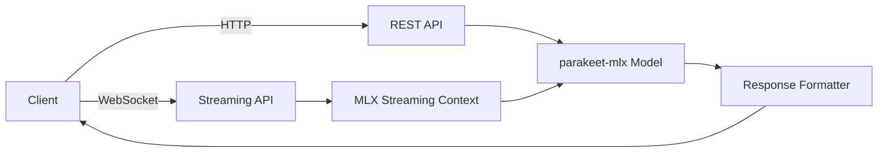

# Parakeet-TDT MLX FastAPI STT Service

A production-ready FastAPI service for high-accuracy English speech-to-text using NVIDIA's Parakeet-TDT models optimized for Apple Silicon via MLX. Implements both REST and WebSocket endpoints following the [OpenAI Audio API specification](https://platform.openai.com/docs/api-reference/audio) interface.

## Features

- **Apple Silicon Optimized**
  - Native MLX implementation for M1/M2/M3 Macs
  - Memory-efficient bf16 precision by default
  - Optimized for local inference without CUDA dependency

- **RESTful transcription**  
  - `POST /transcribe` with multipart audio uploads
  - Word/character/segment timestamps via parakeet-mlx
  - OpenAI-compatible response schema

- **WebSocket streaming**  
  - Real-time streaming transcription with MLX
  - Context-aware streaming with configurable attention windows
  - Supports 16kHz mono PCM input

- **Intelligent chunking**  
  - Built-in audio chunking with overlap for long files
  - Memory-efficient processing via parakeet-mlx
  - Configurable chunk duration and overlap

- **Production-ready deployment**  
  - Docker and Docker Compose support
  - Health checks and configuration endpoints
  - Environment variable configuration

- **Audio preprocessing**  
  - Automatic downmixing and resampling
  - File validation and format conversion

## Table of Contents

- [Prerequisites](#prerequisites)  
- [Installation](#installation)  
- [Configuration](#configuration)  
- [Running the Server](#running-the-server)  
- [Usage](#usage)  
  - [REST API](#rest-api)  
  - [WebSocket Streaming](#websocket-streaming)  
- [Architecture Overview](#architecture-overview)  
- [Environment Variables](#environment-variables)  
- [Contributing](#contributing)  
- [License](#license)  

## Prerequisites

- Python 3.10+  
- Apple Silicon Mac (M1/M2/M3) or Intel Mac for optimal performance
- FFmpeg (for audio format conversion)
- Docker Engine 24.0+ (for container deployment)

**Note**: While parakeet-mlx is optimized for Apple Silicon, it can run on other platforms but may not provide the same performance benefits as the native MLX implementation.

## Installation

### Local Development
```bash
git clone https://github.com/your-repo/parakeet-mlx-fastapi.git
cd parakeet-mlx-fastapi

# Create and activate virtual environment
python -m venv .venv
source .venv/bin/activate

# Install dependencies (includes parakeet-mlx)
pip install -r requirements.txt

# Install FFmpeg if not already installed (macOS)
brew install ffmpeg
```

### Docker Deployment
```bash
docker build -t parakeet-mlx-stt .
docker run -d -p 8000:8000 parakeet-mlx-stt
```

### Docker Compose
```bash
docker-compose up --build
```

## Configuration

All configuration is managed through environment variables. Create a `.env` file with your preferences:

```ini
# Model configuration
MODEL_PRECISION=bf16
BATCH_SIZE=4

# Audio processing
TARGET_SR=16000
MAX_AUDIO_DURATION=30

# System
LOG_LEVEL=INFO
PROCESSING_TIMEOUT=120
```

## Running the Server

### Local Development
```bash
uvicorn parakeet_service.main:app --host 0.0.0.0 --port 8000
```

### Production
```bash
docker-compose up --build -d
```

## Usage

### REST API

#### Health Check
```bash
curl http://localhost:8000/healthz
# {"status":"ok"}
```

#### Transcription
```bash
curl -X POST http://localhost:8000/transcribe \
  -F file="@audio.wav" \
  -F include_timestamps=true \
  -F should_chunk=true
```

**Parameters**:
| Name | Type | Default | Description |
|------|------|---------|-------------|
| `file` | `audio/*` | Required | Audio file (wav, mp3, flac) |
| `include_timestamps` | bool | false | Return word/segment timestamps |
| `should_chunk` | bool | true | Enable audio chunking for long files |

**Response**:
```json
{
  "text": "Transcribed text content",
  "timestamps": {
    "words": [
      {"text": "Hello", "start": 0.2, "end": 0.5},
      {"text": "world", "start": 0.6, "end": 0.9}
    ],
    "segments": [
      {"text": "Hello world", "start": 0.2, "end": 0.9}
    ]
  }
}
```

### WebSocket Streaming

Connect to `ws://localhost:8000/ws` to stream audio:

- **Input**: 16kHz mono PCM frames (int16)
- **Output**: JSON messages with partial/final transcriptions
- **Features**: Context-aware streaming with configurable attention windows

**JavaScript Example**:
```javascript
const ws = new WebSocket("ws://localhost:8000/ws");
const audioContext = new AudioContext();
const processor = audioContext.createScriptProcessor(1024, 1, 1);

processor.onaudioprocess = e => {
  const pcmData = e.inputBuffer.getChannelData(0);
  const int16Data = convertFloat32ToInt16(pcmData);
  ws.send(int16Data);
};

ws.onmessage = evt => {
  const data = JSON.parse(evt.data);
  console.log("Transcription:", data.text);
};
```

## Architecture Overview



**Components**:
1. **`main.py`** - App initialization and lifecycle management
2. **`routes.py`** - REST endpoints implementation
3. **`stream_routes.py`** - WebSocket endpoint with MLX streaming
4. **`model.py`** - parakeet-mlx model interface
5. **`audio.py`** - Audio preprocessing utilities
6. **`config.py`** - Configuration management

**MLX-Specific Features**:
- **Streaming Context**: Context-aware streaming with configurable attention windows
- **Memory Efficiency**: bf16 precision by default for optimal memory usage
- **Built-in Chunking**: Intelligent audio chunking with overlap handling
- **Apple Silicon Optimization**: Native MLX implementation for M-series chips

## Environment Variables

| Variable | Default | Description |
|----------|---------|-------------|
| `MODEL_PRECISION` | bf16 | Model precision (bf16/fp32) |
| `BATCH_SIZE` | 4 | Processing batch size |
| `TARGET_SR` | 16000 | Target sample rate |
| `MAX_AUDIO_DURATION` | 30 | Max audio length in seconds |
| `LOG_LEVEL` | INFO | Logging verbosity |
| `PROCESSING_TIMEOUT` | 120 | Processing timeout in seconds |

## MLX Benefits

- **Apple Silicon Native**: Optimized for M1/M2/M3 processors
- **Memory Efficient**: bf16 precision reduces memory usage by ~50%
- **Local Inference**: No need for cloud APIs or CUDA dependencies
- **Streaming Support**: Real-time transcription with context awareness
- **Easy Installation**: Simple pip install without complex dependencies

## Contributing

1. Fork the repository and create your feature branch
2. Submit a pull request with detailed description
